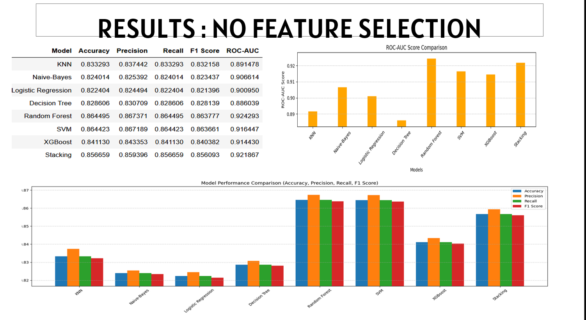
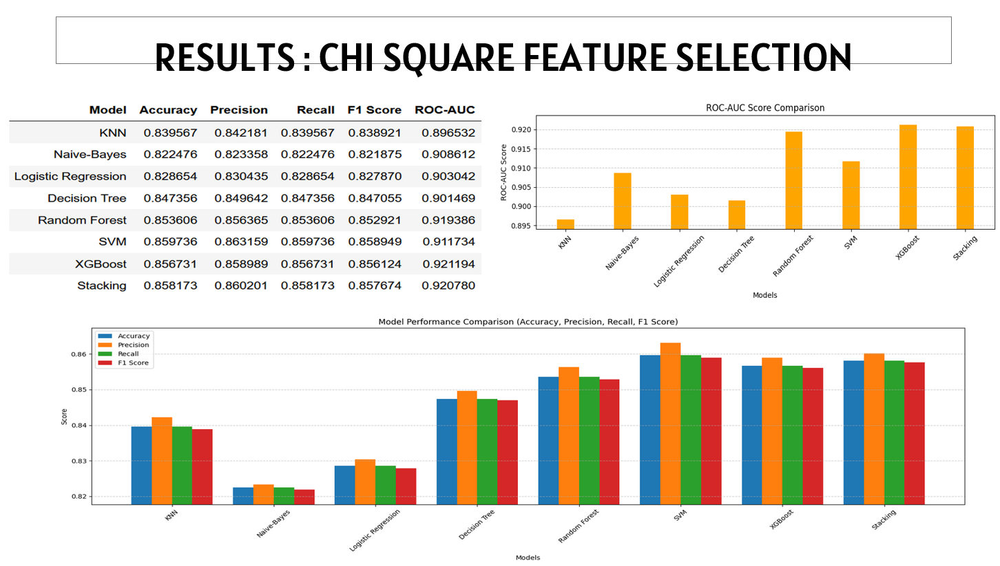

# 🫀 Cardiovascular Disease Detection using Machine Learning

A comparative machine learning project to detect cardiovascular diseases using clinical and lifestyle-related features. This project evaluates multiple ML classifiers, performs feature selection using the Chi-Square test, and compares the predictive performance of models across two settings: **with** and **without** feature selection.

---

## 📌 Objective

- Predict the presence of cardiovascular disease from patient health data.
- Evaluate and compare a range of ML models.
- Understand the impact of feature selection using Chi-Square on model performance.
- Use ensemble learning techniques to improve prediction robustness.

---

## 📊 Dataset Overview

The dataset contains patient health-related information including:

- Age, gender, blood pressure, cholesterol, glucose levels
- Lifestyle indicators: smoking, alcohol intake, physical activity
- Medical history indicators

**Target Variable:** Presence of cardiovascular disease (binary classification)

---

## ⚙️ Workflow

### 1. Data Preprocessing

- Handled missing values
- Encoded categorical variables
- Normalized numeric features
- Balanced class distribution if necessary

### 2. Feature Selection (Chi-Square)

- Identified the most statistically significant features for predicting the target
- Reduced dimensionality to improve performance and reduce overfitting

### 3. Model Training & Evaluation

Tested the following models:

- ✅ K-Nearest Neighbors (KNN)
- ✅ Naive Bayes
- ✅ Logistic Regression
- ✅ Decision Tree
- ✅ Random Forest
- ✅ Support Vector Machine (SVM)
- ✅ XGBoost
- ✅ Stacking (Meta Ensemble)

---

## 🧪 Results

### 🔹 Without Feature Selection

| Model             | Accuracy | Precision | Recall | F1 Score | ROC-AUC |
|------------------|----------|-----------|--------|----------|---------|
| **KNN**           | 0.8333   | 0.8374    | 0.8333 | 0.8322   | 0.8915  |
| **Naive Bayes**   | 0.8240   | 0.8254    | 0.8240 | 0.8234   | 0.9066  |
| **Logistic Reg.** | 0.8220   | 0.8245    | 0.8220 | 0.8214   | 0.9006  |
| **Decision Tree** | 0.8286   | 0.8307    | 0.8286 | 0.8281   | 0.8860  |
| **Random Forest** | **0.8645** | **0.8674** | **0.8645** | **0.8638** | **0.9243** |
| **SVM**           | **0.8644** | 0.8672    | 0.8644 | 0.8637   | 0.9164  |
| **XGBoost**       | 0.8411   | 0.8434    | 0.8411 | 0.8404   | 0.9144  |
| **Stacking**      | 0.8567   | 0.8594    | 0.8567 | 0.8561   | 0.9219  |

> 🔍 **Observation:** Random Forest and SVM yielded the best overall performance without feature selection.

---

### 🔹 With Chi-Square Feature Selection

| Model             | Accuracy | Precision | Recall | F1 Score | ROC-AUC |
|------------------|----------|-----------|--------|----------|---------|
| **KNN**           | 0.8396   | 0.8422    | 0.8396 | 0.8389   | 0.8965  |
| **Naive Bayes**   | 0.8225   | 0.8234    | 0.8225 | 0.8219   | 0.9086  |
| **Logistic Reg.** | 0.8287   | 0.8303    | 0.8287 | 0.8279   | 0.9030  |
| **Decision Tree** | 0.8474   | 0.8496    | 0.8474 | 0.8471   | 0.9015  |
| **Random Forest** | 0.8536   | 0.8564    | 0.8536 | 0.8529   | 0.9194  |
| **SVM**           | **0.8597** | 0.8632    | 0.8597 | 0.8589   | 0.9117  |
| **XGBoost**       | 0.8567   | **0.8599** | 0.8567 | **0.8561** | 0.9212  |
| **Stacking**      | 0.8582   | 0.8602    | 0.8582 | 0.8577   | **0.9208** |

> 🔍 **Observation:** Feature selection improved generalization. XGBoost and Stacking delivered strong ROC-AUC values with competitive accuracy and F1.

---

## 📈 Visualizations

<p align="center">
  
  <br/>
  <em>Performance Metrics Without Feature Selection</em>
</p>

<p align="center">
  
  <br/>
  <em>Performance Metrics With Chi-Square Feature Selection</em>
</p>


---

## 💡 Conclusion

- Ensemble models, particularly Random Forest and Stacking, consistently outperform individual classifiers.
- Chi-Square feature selection improves performance and interpretability.
- ROC-AUC is a critical metric — and shows XGBoost and Stacking excel in ranking quality.

---

## 🔮 Future Enhancements

- 📊 Add more advanced feature selection techniques (RFE, PCA)
- 🤖 Implement deep learning models (e.g., MLP, TabNet)
- 🔍 Use SHAP or LIME for model interpretability
- 📈 Optimize hyperparameters using Optuna or GridSearchCV

---

## 🧠 Requirements

```bash
pip install -r requirements.txt
````

---

## 👩‍💻 Author

**\Arunima**
Machine Learning Enthusiast | CS Undergraduate
[GitHub](https://github.com/Arunima2305) 

---

## 📜 License

This project is licensed under the MIT License. See the [LICENSE](LICENSE) file for more details.

```


